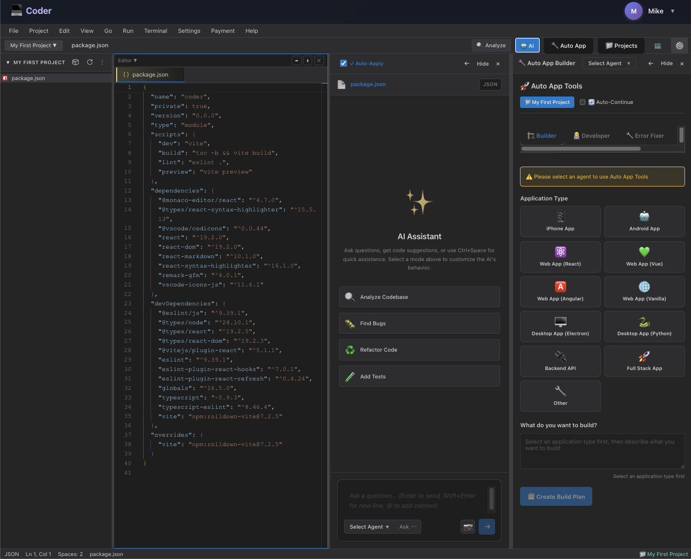

# Web Coder

An online IDE platform with an AI coding assistant: a browser-based environment to write and organize code while the AI helps in your workspace—backed by a **React + TypeScript** frontend (Vite, Monaco Editor) and a **Python Flask** API (auth, projects, code editor, design docs, LLM chat/management, GPU management). Run locally or with **Docker Compose**.

## Screenshot



## Features

### Web app (`app/`)

- **Code editor** — Monaco-based editing, file tree, projects, AI-assisted panel
- **Design docs** — Project documentation workspace
- **LLM chat** — Chat against configured models
- **LLM manager** — Model and provider configuration
- **GPU management** — Register and monitor GPUs for workloads
- **Accounts** — Login, registration, profile/settings (JWT/session flow via backend)

### Backend (`backend/`)

- **REST API** with SQLAlchemy and SQLite by default (`coder.db`)
- **Blueprints registered in `backend/src/application.py`:**  
  `/api/auth`, `/api/users`, `/api/projects`, `/api/code-editor`, `/api/design-docs`, `/api/llm`, `/api/llm/manager`, `/api/gpus`
- **Health check:** `GET /api/health`
- **Entrypoint:** `backend/app.py` → `create_app()` in `backend/src/application.py`

> Optional blueprint modules under `backend/src/api/routers/` (e.g. wallets, prices, transactions) are **not** wired in by default. Register them in `application.py` if you need those APIs.

## Project structure

```
Coder/
├── app/                  # React (Vite) frontend
├── backend/              # Flask API
│   ├── routes/           # API blueprints
│   ├── instance/         # Local SQLite (coder.db) when not using Docker DB path
│   ├── app.py
│   ├── requirements.txt
│   ├── Dockerfile
│   └── start.sh / start.bat
├── client/               # Optional GPU agent client
├── documents/            # Extra docs (troubleshooting, GPU setup); see documents/README.md
├── scripts/              # Helper scripts (e.g. freeing ports)
├── docker-compose.yml    # Backend + frontend
└── start.sh              # Dev: backend + frontend (repo root)
```

## Quick start (Docker)

**Prerequisites:** Docker with Compose support.

```bash
docker compose up -d
```

- **Frontend:** http://localhost:5173  
- **Backend:** http://localhost:5000  
- **Health:** `curl http://localhost:5000/api/health`

View logs: `docker compose logs -f` · Stop: `docker compose down` · Rebuild: `docker compose up -d --build`

## Manual setup

### Backend

```bash
cd backend
python3 -m venv venv
source venv/bin/activate   # Windows: venv\Scripts\activate
pip install -r requirements.txt
python app.py
```

Or use `./start.sh` (macOS/Linux) / `start.bat` (Windows) from `backend/`.

API: http://localhost:5000 — default DB file: `backend/instance/coder.db` unless `DATABASE_URL` is set.

### Frontend

```bash
cd app
npm install
npm run dev
```

Point the UI at your API (see **Environment variables**). Default dev URL is typically http://localhost:5173 (see Vite config / console output).

### Repo root: both servers

From the repository root, `./start.sh` can start the backend and frontend together (see script for behavior).

## Environment variables

| Scope | Variable | Purpose |
|--------|----------|---------|
| Backend | `DATABASE_URL` | SQLAlchemy URL (default: SQLite `instance/coder.db` under `backend/`) |
| Backend | `FLASK_APP`, `FLASK_DEBUG`, `PORT` | Flask / server port (default `5000`) |
| Frontend | `VITE_API_URL` | Backend base URL (e.g. `http://localhost:5000` for local dev) |

In Docker Compose, `DATABASE_URL` for the main API is set to SQLite at `/app/data/coder.db` with `./backend/data` mounted there.

## Database

- **Local:** `backend/instance/coder.db` (created automatically)  
- **Docker:** `/app/data/coder.db` inside the container (host: `backend/data/`)

To use PostgreSQL or MySQL, set `DATABASE_URL` accordingly in the environment or `docker-compose.yml`.

## Documentation

- **[documents/README.md](documents/README.md)** — Index of guides  
- **[documents/TROUBLESHOOTING.md](documents/TROUBLESHOOTING.md)** — CORS, ports, backend not running  
- **[documents/GPU_SETUP.md](documents/GPU_SETUP.md)** — GPU management architecture  

## Development notes

- **New API surface:** add a blueprint under `backend/src/api/routers/`, then `register_blueprint(...)` in `backend/src/application.py`.  
- **Models:** add or edit modules under `backend/src/models/` and export them from `backend/src/models/__init__.py`; run migrations/schema updates as appropriate for your DB.

## Technologies

- **Frontend:** React, TypeScript, Vite, Monaco Editor  
- **Backend:** Python, Flask, Flask-SQLAlchemy, SQLAlchemy  
- **Database:** SQLite by default; configurable via `DATABASE_URL`  
- **Containers:** Docker, Docker Compose  

## License

[Apache License 2.0](LICENSE).
